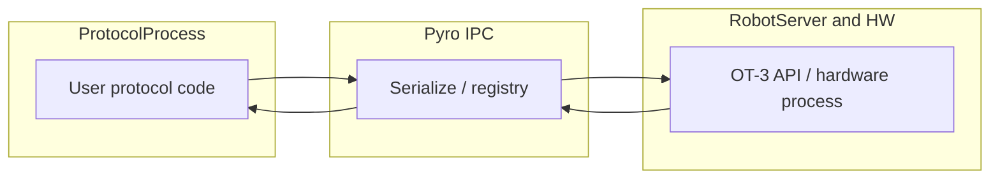

# Pyro / protocol subprocess — QA protocol plan

## Serialization in one paragraph (for your April 22 notes)

**Serialization** here means turning Python objects that cross the **protocol process ↔ robot-server/hardware** boundary into bytes (via Pyro/Serpent + Opentrons type registry) and back. If a type is wrong or unregistered, you get **wrong values, crashes, or silent corruption** after the round trip—not just “slower RPC.” Your “half coverage” risk is exactly: **some hardware/API surfaces serialize cleanly, others still throw or truncate at the boundary.** Protocols below are chosen to **exercise many surfaces** (modules, liquids, RTP, large command lists, peripherals) so failures show up as **wrong motion, wrong state in App, or hard errors** rather than only unit-test gaps.

## What protocols cannot fully replace

Some of your checklist is **not** a user protocol:

- **E-stop**: Validate with **manual E-stop during a long run** (or hardware-in-the-loop) while monitoring run state, recovery, and that **robot-server stays alive**; pair with any existing generic ops smoke.
- **Network packet loss / UDS chaos**: Typically **integration/system tests** (EXEC-2535), not something a Python protocol induces; use **long runs + monitoring** as a poor man’s soak, or engineering-driven fault injection.
- **REPL / Jupyter-style sessions**: Confirm separately in **App or robot API** after deploy; not covered by `run()` protocols.
- **“Thread manager / `.wrapped`” misuse**: Add a **negative REPL or one-off script** case (intentionally bad object) if you need to prove **clear errors** at the boundary—not necessarily a shipped QA protocol.

Protocol runs still give the **end-to-end proof** that **real user code** round-trips through the stack you diagrammed: **Engine/OT-3 API → async Pyro → serialize → … → sync wrapper → OT-3 API**.

## Environment matrix (run each bucket at least once)

- **Feature flag OFF vs ON** ([EXEC-2189](https://opentrons.atlassian.net/browse/EXEC-2189) family): baseline vs subprocess path; compare **time-to-start**, **stability**, and **logs**.
- **Sim vs real hardware**: Sim catches many **logic** issues; **camera, plate reader, stacker timing, E-stop** need hardware or robot-like integration.
- **Repeat**: For P0 candidates, **N ≥ 3** consecutive runs; for soak, **50+** on one “max stress” pick.

---

## P0 — Release gate (subprocess + IPC + lifecycle)

Short label: **prove run creation, execution, cancellation, and cleanup** without your full regression suite.

| Goal | Rationale | Candidate in this repo |
|------|-----------|-------------------------|
| Minimal happy path | Baseline IPC | Short flex/PD smokes under [`QA_Opentrons_Branches/Template_Protocols/Flex_protocol_viz/`](QA_Opentrons_Branches/Template_Protocols/Flex_protocol_viz/) e.g. [`pd_smoke_test.py`](QA_Opentrons_Branches/Template_Protocols/Flex_protocol_viz/pd_smoke_test.py), [`Flex_Protocol_Viz_No_Module_smokepy.py`](QA_Opentrons_Branches/Template_Protocols/Flex_protocol_viz/Flex_Protocol_Viz_No_Module_smokepy.py) (also mirrored under Command_Annotations) |
| **RTP / mixed types** | Stress **str/int/float/choices** through parameter plumbing | [`Flex_S_2_2_P200_96_GRIP_HS_MB_TC_TM_Overrides_SmokeTestWith2Stackers (9).py`](QA_Opentrons_Branches/Template_Protocols/Flex_protocol_viz/Flex_S_2_2_P200_96_GRIP_HS_MB_TC_TM_Overrides_SmokeTestWith2Stackers%20(9).py) (comments reference **CSV RTP**), [`concorrent_module_check_command_annotations.py`](QA_Opentrons_Branches/Template_Protocols/Command_Annotations/concorrent_module_check_command_annotations.py), [`Concurrent_modules_Juggling.py`](QA_Opentrons_Branches/Template_Protocols/Flex_Concurrent_Modules/Concurrent_modules_Juggling.py), [`Liquid_Class_Smoke.py`](QA_Opentrons_Branches/Template_Protocols/Liquid_Classy/Liquid_Class_Smoke/Liquid_Class_Smoke.py) |
| **Many commands / large PE graph** | Serialization volume + **command list** size | [`96_channel_real_rprotocol.py`](QA_Opentrons_Branches/Template_Protocols/Flex_protocol_viz/96_channel_real_rprotocol.py), [`complex_moves_within_wells_for_real_protocol.py`](QA_Opentrons_Branches/Template_Protocols/Flex_protocol_viz/complex_moves_within_wells_for_real_protocol.py) |
| **Cancel / stop mid-run** | Run lifecycle ([EXEC-2198](https://opentrons.atlassian.net/browse/EXEC-2198)) | Run P0 long protocol → **cancel from App** (or API) mid-execution; confirm **clean failure**, no zombie run, server responsive |
| **Crash recovery** | Protocol process death | **Engineering step**: `kill -9` on protocol subprocess during run (pairs with your checklist §4.6); not protocol-selective but **must** be done once per candidate build |

**“Golden tip RTP”**: Use the Flex_protocol_viz stacker/RTP-heavy file above and **`Liquid_Class_Smoke`-style RTP** to vary **flow rates, volumes, and choices**—that hits **float/int/str** without a custom script.

---

## P1 — Domain peripherals (large payloads / “big” tests)

These map to your **big camera**, **big plate reader**, and **resource-heavy** concerns.

| Area | Candidate | Pyro angle |
|------|-----------|------------|
| **Camera** | [`Camera_Take_All_the_Photos.py`](QA_Opentrons_Branches/Template_Protocols/Camera/Camera_Take_All_the_Photos.py), [`Camera_Quick_Check_flex.py`](QA_Opentrons_Branches/Template_Protocols/Camera/Camera_Smoke_Flex/Camera_Quick_Check_flex.py) | Many image/capture steps → **larger results objects** and more RPC churn |
| **Plate reader** | [`plate_reader_Smoke.py`](QA_Opentrons_Branches/Template_Protocols/Plate_Reader/plate_reader_smoke/plate_reader_Smoke.py), CSV/handoff variants per [qa-plate-reader](.cursor/skills/qa-plate-reader/SKILL.md) | Wavelength sets, **CSV** path, **error** scripts (e.g. [`partial_error_off_deck_plate_reader.py`](QA_Opentrons_Branches/Template_Protocols/Plate_Reader/partial_error_off_deck_plate_reader.py), [`Plate_Reader_Test_bad_configs.py`](QA_Opentrons_Branches/Template_Protocols/Plate_Reader/Plate_Reader_Test_bad_configs.py)) |
| **Thermocycler / lid / errors** | [`TC_Lid_Errors_tour.py`](QA_Opentrons_Branches/Template_Protocols/TC_LID/TC_Lid_Errors_tour.py), [`lid_smoke_test.py`](QA_Opentrons_Branches/Template_Protocols/TC_LID/Lid_Smoke/lid_smoke_test.py) | **Nested module objects**, **error propagation** across boundaries |
| **Stackers / timing** | [`flex_stacker_smoke.py`](QA_Opentrons_Branches/Template_Protocols/Stacker_Time/stacker_smoke/flex_stacker_smoke.py) | Async-ish hardware interactions, **longer wall time** (your “does the protocol take longer?” baseline) |

---

## P2 — PD / analysis / viz interoperability

Aligns with **analysis path** ([EXEC-2201](https://opentrons.atlassian.net/browse/EXEC-2201)) and “80% layering” acceptance.

- [`PD_PCR.py`](QA_Opentrons_Branches/Template_Protocols/PD protocols and their analysis today/PD_PCR.py) — PD-sourced, multi-module.
- [`Interop_Module_Check.py`](QA_Opentrons_Branches/Template_Protocols/PD protocols and their analysis today/Interop_Module_Check.py) — interop smoke.
- [`command_annotations_og_PR.py`](QA_Opentrons_Branches/Template_Protocols/Command_Annotations/command_annotations_og_PR.py) / [`set_up_command_annotations_api_testing.py`](QA_Opentrons_Branches/Template_Protocols/Command_Annotations/set_up_command_annotations_api_testing.py) — **annotation-heavy** command streams for tooling.

Run these with **feature flag ON** and confirm **analysis / export / viz** match baseline (your “other layers accepting output”).

---

## Early ABR-style run

- [`flex_volumetric_low_volumes.py`](QA_Opentrons_Branches/Template_Protocols/Liquid_Classy/flex_volumetric_low_volumes.py) (`metadata`: **“Flex ABR Low Volumes”**) — good **early** candidate for **liquid class + low-volume** sensitivity.
- [`bug_located_ABR_11.py`](QA_Opentrons_Branches/Template_Protocols/misc_point_features/bug_located_ABR_11.py) — **ABR-named** snippet-style workflow; use if it matches your deck SOPs.

---

## Pipette / tips / 96-channel (hardware API breadth)

- [`20uL_tip_test_p96_200.py`](QA_Opentrons_Branches/Template_Protocols/20uL_tips_pipette/20uL_tip_test_p96_200.py), [`200uL_20uL_tip_test.py`](QA_Opentrons_Branches/Template_Protocols/20uL_tips_pipette/200uL_20uL_tip_test.py) — **tip racks, adapters, 8ch/96ch** mix per [qa-20ul-tips-pipette](.cursor/skills/qa-20ul-tips-pipette/SKILL.md).
- [`PeekPipetteCheck`](QA_Opentrons_Branches/Template_Protocols/PeekPipetteCheck/) (if present in tree) — nozzle/peek edge cases.

---

## OT-2 spot-check (if you ship OT-2 on same train)

- [`OT2_smoke_2.28.py`](QA_Opentrons_Branches/Template_Protocols/ot2_smoke_228/OT2_smoke_2.28.py), [`Camera_Quick_Check_ot2.py`](QA_Opentrons_Branches/Template_Protocols/Camera/Camera_Smoke_OT2/Camera_Quick_Check_ot2.py) — ensures **robotType** split did not rot.

---

## Non-functional checklist tied to protocols

- **Latency / duration**: Record **wall time** and **time-to-first-command** for the same protocol **flag OFF vs ON**; flag ON includes **~24s eager subprocess** cost per [recent PR theme](https://github.com/search?q=repo%3AOpentrons%2Fopentrons+pyro&type=pullrequests)—set expectations in release notes.
- **Communication errors**: When RPC fails, prefer **logged Pyro errors + run failed** over hang; long protocols above make **timeouts** easier to observe.
- **E-stop**: Run **during** a P1 long step (e.g. module or many moves), then verify **recovery** and **no server wedging**.

---

## Optional follow-up (if you want explicit “registry golden” coverage)

If unit/integration tests still leave gaps, add **one small dedicated protocol** that:

- Imports `parameters` with **extreme but valid** floats/ints/strings,
- Touches **liquids**, **one module**, and **one peripheral** if on deck,
- Logs **`protocol.commands()`** length or similar for **deterministic comparison** flag OFF/ON.

That would live next to existing templates—not replacing **CI serialization tests**, but giving **field QA** a single “boundary torture” file.

## References

- Epic / scope: [EXEC-2187](https://opentrons.atlassian.net/browse/EXEC-2187), child issues [JQL](https://opentrons.atlassian.net/issues/?jql=parent%20%3D%20EXEC-2187%20ORDER%20BY%20created%20DESC)
- PR landscape (Pyro): [GitHub PR search: repo:Opentrons/opentrons pyro](https://github.com/search?q=repo%3AOpentrons%2Fopentrons+pyro&type=pullrequests)
